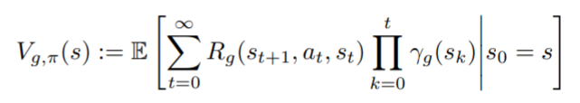

# Universal Value Function Approximators

abstract intro conclusion

value fns - typically construct single fn approx V(s; theta) estimating long term reward from state s.

introduce V(s, g; theta) that also generalise over goals

utilize supervised learning of UVFAs
- learn embedding for s and g
- then learn mapping to embeddings

able to generalize to unseen goals

Value fns:
- cache knowledge to represent utilty of a state s
- V_g(s) represent utility of state s in achieving a goal g
- pseudo-reward function to reperesent progress towards "waypoint" goal

goal space often contains just as much structure as the state space

since this structure is so similar, we extend value fn approx to both states and goals using UVFAs
- both identify and exploit structure across both s and g

universal: value fn can generalise to any goal g in a set G of possible goals

exploit two kinds of structure b/w goals:
1. similarity encoded a priori in goal representations
2. structure in induced value fns discovered bottom up

complexity of UVFA learning does not depend on no. of "demons" but on the inherent domain complexity

note: demons are a discrete set of value functions (see Horde architecture from Sutton 2011)

complexity is larger than standard value fn approx, so you need a rich fn approximator like a DNN for UVFA

Challenges of learnin a UVFA:

- agent only sees small subset of (s, g) but we want to generalize in several diff ways

- introduce a factorization approach to decompose the regression problem into two states:
1. find low-rank factorization of a table (sparse table that contains one row for each state, and one column of each observed goal g) into state embeddings and goal embeddings
2. learn non-linear mappins from states s to state embeddings, and goals to goal embeddings (with standard regression techniques like gradient descent)

this learns much faster

2 algorithms for learning UVFAs directly from rewards
1. Finite Horde of general value functions and use thse values to seed the table and learn a UVFA that generalizes to prev unseen goals
2. bootstrap directly from value of UVFA at successor states

Conclusion:

UVFA learnable from either supervised targets or directly from real experience.

UVFAs can be used for transfer learning to new tasks with same dynamics but different goals
- the values in a UVFA can be used to initialise a new single value function for a new task with unseen goal

generalized value functions can be used as features to represent state. This is a form of predictive representation. A UVFA compresses a large number of predictions into a short feature vector (with state embedding and goal embeddings)

can also generate temporally abstract options with UVFA. For any goal g you can construct a greedy option to V and terminate upon reaching g - universal option that represents optimal behaviour towards any goal. *can use with hierachial policies*

Universal option model - if psuedo-rewards are defined by goal achievement. Then V approximates the probability of reacing g from s (discounted prob), under a policy that attempts to reach it.

### Second pass

For every goal g from set G, we define the following:
- psuedo-reward fn R_g(s, a, s')
- psuedo-discount function gamma_g(s)

psuedo-discount takes double role of state-dependent discounting and soft termination (gamma(s) = 0 iff s is a terminal state, e.g. the goal g is reached)

Q fn basically looks the same, uses psuedo-discounted fn as well

Note that a goal implies an optimal policy wrt to the goal

from diagrams:
the 2stage dot seems to be performing the best (two stage training)

V(s, g; theta) ~= optimal V wrt g

Architectures proposed:

1. literally just concat state and goal and shove em into a non-linear fn approx (e.g. NN)
2. "two-stream" - assume factorized structure. states and goals are made into embeddings, and then combined

Commonalities between goal and state embedding layers:
- parameters of first layers are shared
- since UVFA might be symmetric (e.g. V(s) = V(g)), then the network can just be the same for both, and the output function b/w the two embeddings will be symmetric too

so you get two different cases: partially symmetric, and symmetric

How to learn??

Direct E2E
- directly just backprop a value estimate V(s, g)

Two-stage training: exploits that G is subset of S
- make a matrix: rows - states, cols - goals
- then factorize the matrix to make low-rank approximation (defines embedding space for both states and goals)

- then learn the parameters of the separate goal and state embedding networks, using the embedding vectors from factorization as the target reference

Why this way???
- first stage ensures that the vectors are ideal and can reconstruct original values
- second stage merely tries to make a network do the same in a more generalized sense
- there's technically a third finetuuning stage

note: used OptSpace for matrix factorization with batch data (and the combining fn b/w embeddings is the dot prod). Otherwise used SGD

#### Supervised learning

paper assumes goals are states, and entering goals are rewarded

they first did tabular representations of the UVFA, representing states and goals by 1-hot unit vectors. The goal and state mappins are identity fns.

in experiments, they increasingly made the matrix more and more sparse and it still did pretty well. they conclude this means UVFA generalizes decently

It also works decently on interpolation and dealing with an expanding set of similar goals, and transfer learning works pretty well just by post-training the UVFA on new goals - it's notably faster than training from scratch.

#### Extrapolation

generalizing to unseen goals in completely new parts of states

partially symmetric architecture helps you get from seen states to unseen goals. knowledge transfer!!
